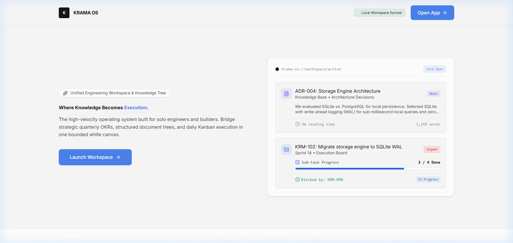
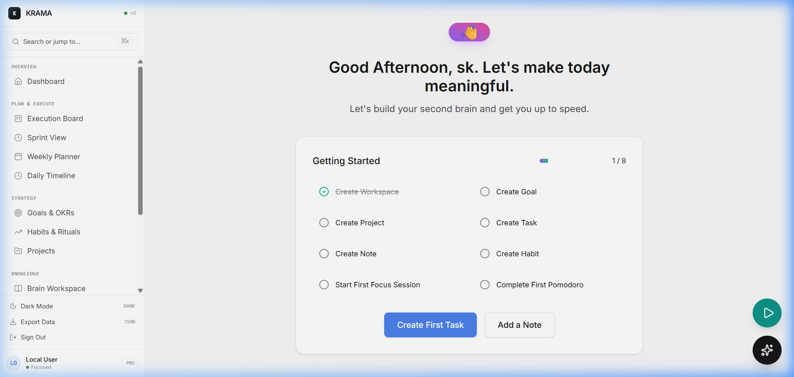
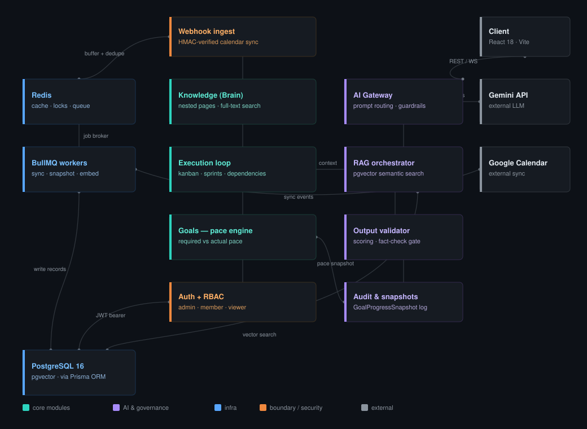
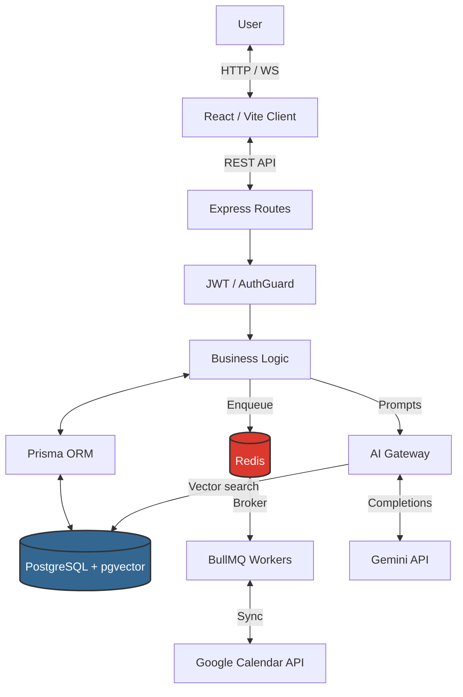
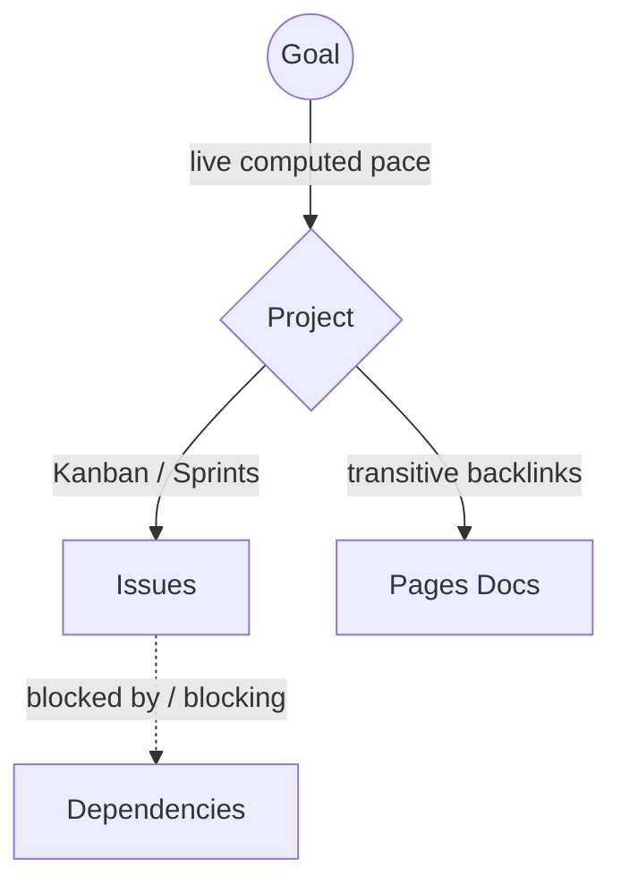

<div align="center">
  <h1>⚡ KRAMA OS</h1>
  <h3>A Personal Operating System for Knowledge, Execution, and Progress</h3>
  Plan · Build · Track · Reflect
  <br/><br/>
  <b>One Project. Every layer connected.</b>
</div>
<br/>

<div align="center">
  
  
</div>
<br/>

<div align="center">
  <a href="#-chapter-one--the-problem">The Problem</a> ·
  <a href="#-chapter-two--how-its-built">The Architecture</a> ·
  <a href="#-chapter-three--the-cast-of-components">The Cast</a> ·
  <a href="#-technical-stack">The Stack</a> ·
  <a href="#-chapter-four--getting-started">Get Started</a> ·
  <a href="#-design-principles">Principles</a>
</div>

<br/>

## 📖 Chapter One — The Problem

Every productivity setup eventually splits into three lives.

Your notes live in one app. Your tasks live in another. Your goals — if they exist anywhere outside your head — live in a spreadsheet nobody has opened since March. None of these tools know the others exist. You are the integration layer, and you're a bad one: forgetful, tired, and busy actually doing the work these tools are supposed to be tracking.

The tempting fix is "one app that does everything." That's not what KRAMA is.

KRAMA's answer is narrower, and more honest: build one entity — **the Project** — that connects everything that already has to exist anyway. The documentation you write. The issues you work through. The Goal all of it is supposed to be serving. Not a merger of three apps crammed into one UI — a bridge between three things that always should have talked to each other and never did.

<table>
  <tr>
    <td width="33%" valign="top">
      <b>🧠 Knowledge Base</b><br/>
      Nested pages, a rich block editor — where thinking gets written down.
    </td>
    <td width="33%" valign="top">
      <b>⚡ Execution Engine</b><br/>
      Kanban, sprints, real dependencies — where thinking turns into motion.
    </td>
    <td width="33%" valign="top">
      <b>🎯 Goal Tracker</b><br/>
      Required vs. actual pace, computed — not vibes.
    </td>
  </tr>
</table>

...bridged by a Project entity that most tools never bother connecting.

---

## 🏗 Chapter Two — How It's Built

KRAMA runs as a tightly integrated monorepo, with a relational database as the single source of truth — and Redis handling the fast, ephemeral stuff: distributed locks and caching.

One request, start to finish: a calendar push hits the webhook ingest, gets buffered and deduped through Redis, and handed to a BullMQ worker to sync, snapshot, or embed. Meanwhile the client talks REST/WS straight into the Knowledge → Execution → Goals spine — the same three modules the Bridge Layer keeps foreign-keyed together — all backed by PostgreSQL through Prisma. Any AI-assisted feature routes through the AI Gateway: it pulls context via the RAG orchestrator (`pgvector`), calls Gemini, and forces every response through the output validator before anything reaches the user. Auth + RBAC gates the spine; Audit & snapshots records what the Goals engine measured, so pace is provable, not just displayed.

**What changed from a typical CRUD app, and why:**
* **The AI Gateway is a chokepoint, not a convenience.** Nothing calls Gemini directly — every prompt is routed, every response is scored by the validator before it reaches the client. That's what makes "AI-assisted" mean something instead of being a marketing label on a raw completion.
* **BullMQ workers own anything slow or external** (calendar sync, pace-snapshot computation, embedding generation), keeping the request/response cycle fast and making retries and backoff a queue concern, not an API concern.
* **Redis plays three distinct roles** — cache, distributed lock, and job broker — deliberately kept on one instance rather than three services, since the local-first deployment target doesn't justify the operational overhead of separating them.
* **The spine is real, not aspirational.** Knowledge, Execution, and Goals aren't three features that happen to share a database — they're foreign-keyed to the same Project, which is the whole thesis of the Bridge Layer below.

<br/>
<div align="center">
  
</div>
<br/>

<details>
  <summary><b>Component-level view (Mermaid)</b></summary>


</details>

### 🌉 The Bridge Layer

The part that turns three separate tools into one system. Every relation here is a real Prisma foreign key with proper cascade and restore semantics — not a loose reference held together by convention.



---

## 🧩 Chapter Three — The Cast of Components

<table>
  <tr>
    <td width="50%" valign="top">
      <b>🧠 Brain (The Knowledge Layer)</b><br/><br/>
      <i>The place where thinking gets written down before it gets acted on.</i><br/><br/>
      • Nested Spaces → Pages, arbitrarily deep<br/>
      • Rich block editor (Tiptap) with slash commands<br/>
      • Full-text search via PostgreSQL <code>tsvector</code> + <code>ts_rank</code>
    </td>
    <td width="50%" valign="top">
      <b>⚡ Execution Loop (The Doing Layer)</b><br/><br/>
      <i>The place where thinking turns into motion.</i><br/><br/>
      • Kanban Board — drag-and-drop (<code>@dnd-kit</code>), sub-tasks, dependency badges on cards<br/>
      • Sprint View — burndown %, focus vs. completed splits<br/>
      • Weekly Planner & Daily Timeline — macro 7-day capacity + hour-by-hour tactics
    </td>
  </tr>
  <tr>
    <td width="50%" valign="top">
      <b>🎯 Goals (The Strategic Layer)</b><br/><br/>
      <i>The place that keeps the other two honest.</i><br/><br/>
      • Yearly → Quarterly → Monthly hierarchy with automatic rollups<br/>
      • Pace Engine — Required vs. Actual pace, computed from historical <code>GoalProgressSnapshot</code> records
    </td>
    <td width="50%" valign="top">
      <b>🔥 Habits & Daily Review (The Catch-All Layer)</b><br/><br/>
      <i>The place that catches what the trackers miss.</i><br/><br/>
      • Habits surfaced across Dashboard, Timeline, and Planner<br/>
      • Daily Review — deep-work stopwatch, mood/energy calibration, wins/blockers journal
    </td>
  </tr>
</table>

### 🤖 AI Services — The Intelligence Layer
The place that reads everything else and says something useful about it. An AI service architecture powers the Daily Narrative Assistant and workspace automation, using semantic RAG (via `pgvector`) to ground responses in your actual project data — not generic advice.

---

## 🛠 Technical Stack

| Layer | Technologies |
| --- | --- |
| **Frontend** | React 18 · TypeScript · Vite · Tailwind CSS · shadcn/ui · React Query · Tiptap · `@dnd-kit` |
| **Backend** | Node.js 20+ · Express · TypeScript |
| **Database** | PostgreSQL 16 (with `pgvector`) · Prisma ORM |
| **Caching & Locking** | Redis |
| **Auth** | JWT + httpOnly cookies |
| **Tooling** | Turborepo-style Monorepo (pnpm workspace) · Biome/Oxlint · Playwright (E2E) |

---

## 🚀 Chapter Four — Getting Started

KRAMA is built as a single-tenant, local-first web app.

```bash
# 1. Clone the repository
git clone <repo-url> && cd krama

# 2. Install dependencies (requires pnpm >= 9.0.0)
pnpm install

# 3. Start infrastructure — Postgres & Redis
# Note: Docker must be running. The local setup is lightweight (< 500MB).
docker compose up -d db redis

# 4. Set up the database and environment variables
cd apps/server
cp .env.example .env
npx prisma db push
npx prisma generate

# 5. Run the full stack
cd ../..
pnpm dev
```

<div align="center">
  Then visit <code>http://localhost:5173</code> to launch KRAMA OS. 🎉
</div>

---

## 🎨 Design Principles

| # | Principle | What it means |
| --- | --- | --- |
| **1** | **Restraint over decoration** | Color and visual weight are used deliberately. Full semantic Dark Mode support. |
| **2** | **Match structure to data** | A calendar looks like a calendar. A pipeline looks like a pipeline. |
| **3** | **Distributed where visibility matters, unified where truth matters** | Habits appear in four places; they're backed by one table. |
| **4** | **Verify, don't assume** | Every component ships with an automated, end-to-end test proving the feature against a real database before it's called done. |

<br/>

<div align="center">
  <b>One Project. Every layer connected.</b><br/>
  Built solo — schema, API, and UI — as a real, daily-use tool.<br/><br/>
  <sub>⭐ If KRAMA's approach resonates with you, consider starring the repo.</sub>
</div>