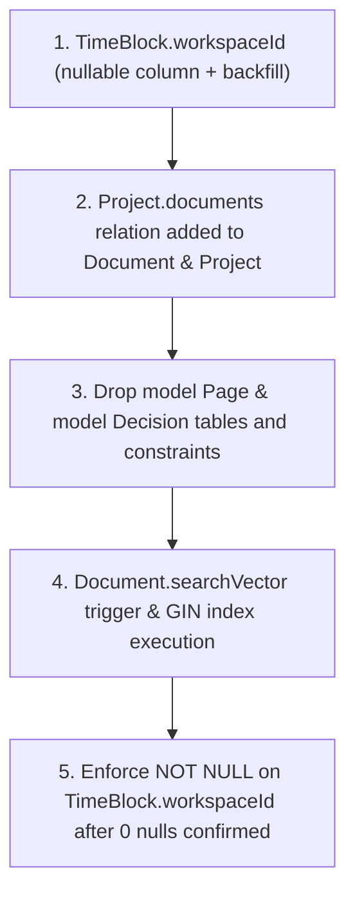

# 12 — Database Schema Migrations (Consolidated)

**Priority:** Run first, before files 01–11 (per `00-INDEX.md` Global Execution Order).  
**Target:** `apps/server/prisma/schema.prisma`, plus raw-SQL trigger setup script and migrations.  
**Touches:**
- `apps/server/prisma/schema.prisma`
- `apps/server/src/scripts/setup-brain-triggers.ts`
- `apps/server/src/utils/selectors.ts`
- `apps/server/src/controllers/project.controller.ts`

---

## 1. Scope

This document consolidates every Prisma schema change and raw database DDL requirement from the entire remediation architecture set into one authoritative specification. Rather than scattering schema diffs across functional-fix documents, each item is defined here with explicit backfill strategies, dependency graphs, and execution ordering.

---

## 2. Hard Rules

1. **Proper Migration Flow:** Migrations must be written and tracked via Prisma migrations (`prisma migrate dev` / `prisma migrate deploy`) or reproducible raw SQL migration scripts, never ad-hoc undocumented database pushes.
2. **Backfill Before NOT NULL:** Every migration adding a `NOT NULL` column to a table with existing rows requires a safe nullable-with-default or multi-stage backfill strategy. For `TimeBlock.workspaceId`, rows must be backfilled before any `NOT NULL` constraint is applied.
3. **Foreign Key Integrity During Drops:** Foreign keys pointing to deprecated models (such as `Project.pages` pointing to `Page`) must be repointed or dropped in the same migration step as the table drop to prevent foreign key constraint violations.
4. **No Spurious Constraints:** Do not add redundant composite unique constraints to models where an `@id` primary key already exists (e.g., `Milestone`). The fix for compound `where` validation errors is application-layer query restructuring.

---

## 3. §12.1 — Add `TimeBlock.workspaceId` (Ref: Audit §3.4, `02-SECURITY-AND-IDOR.md` SEC-04)

### Context & Root Cause
`TimeBlock` previously held only `userId`, causing calendar entries and scheduled blocks to bleed across multiple workspaces for users with multi-tenant memberships.

### Schema Definition
```prisma
model TimeBlock {
  id          String        @id @default(uuid())
  userId      String
  workspaceId String?
  title       String
  date        DateTime
  startTime   DateTime
  endTime     DateTime
  type        TimeBlockType
  taskId      String?
  projectId   String?
  notes       String?
  syncStatus  SyncStatus    @default(LOCAL_ONLY)
  createdAt   DateTime      @default(now())
  updatedAt   DateTime      @updatedAt

  user      User       @relation(fields: [userId], references: [id], onDelete: Cascade)
  workspace Workspace? @relation(fields: [workspaceId], references: [id], onDelete: Cascade)
  task      Task?      @relation(fields: [taskId], references: [id], onDelete: SetNull)
  project   Project?   @relation(fields: [projectId], references: [id], onDelete: SetNull)

  @@index([userId, date])
  @@index([workspaceId])
}
```

### Multi-Step Backfill Strategy
1. **Phase 1 (Nullable Column):** Add `workspaceId String?` and `workspace Workspace?` relation as nullable.
2. **Phase 2 (Data Backfill):**
   - For rows with a linked `taskId`, resolve `workspaceId` directly from `Task.workspaceId`.
   - For rows with a linked `projectId`, resolve `workspaceId` from `Project.workspaceId`.
   - For standalone blocks, backfill from the user's primary or oldest active `WorkspaceMember` record:
     ```sql
     UPDATE "TimeBlock" tb
     SET "workspaceId" = (
       SELECT wm."workspaceId"
       FROM "WorkspaceMember" wm
       WHERE wm."userId" = tb."userId"
       ORDER BY wm."createdAt" ASC
       LIMIT 1
     )
     WHERE tb."workspaceId" IS NULL;
     ```
3. **Phase 3 (Enforce NOT NULL):** After confirming 0 nulls remain across all environments, finalize `workspaceId String` with `onDelete: Cascade`.

### Application-Layer Dependency
All queries in `apps/server/src/routes/planner.routes.ts` and `apps/server/src/services/focusTimer.service.ts` now filter by `{ userId, workspaceId, date: ... }` per `02-SECURITY-AND-IDOR.md` (SEC-04).

---

## 4. §12.2 — Expand `userAuthSelect` (Ref: Audit §2.1 pt. 4, `01-AUTH-AND-WORKSPACE.md` AUTH-03)

### Context & Implementation
This is an application-layer Prisma `select` configuration change in `apps/server/src/utils/selectors.ts`, not a database migration. It ensures `WorkspaceMember` includes the full `workspace` object:
```ts
export const userAuthSelect = {
  id: true,
  email: true,
  name: true,
  avatar: true,
  weeklyCapacityMinutes: true,
  metadata: true,
  memberships: {
    select: {
      role: true,
      workspaceId: true,
      workspace: {
        select: {
          id: true,
          name: true,
          metadata: true
        }
      }
    }
  }
} as const;
```

---

## 5. §12.3 — Remove `model Page` and `model Decision` (Ref: Audit §8.1, `10-DEAD-CODE-REMOVAL.md` DEAD-01, DEAD-05)

### Verification & Pruning
- Confirmed zero active references across `apps/server` and `apps/web` after the knowledge base unified around `Space` and `Document`.
- Dropped the following models and their obsolete relations from `apps/server/prisma/schema.prisma`:
  - `model Page`
  - `model Decision`
- Dropped routes and controllers: `page.routes.ts`, `page.controller.ts`.
- Repointed `Project` relation to `Document` before executing the table drops.

---

## 6. §12.4 — Fix `Project.pages` → `Project.documents` Relation (Ref: Audit §7.3)

### Context & Schema Change
`Project` previously declared `pages Page[] @relation("ProjectPages")` while `Document` had an unlinked `projectId String?`. `project.controller.ts` counted dead `pages` instead of real documents.

### Updated Schema
```prisma
model Project {
  // ...
  tasks         Task[]
  documents     Document[]
  sprints       Sprint[]
  focusSessions FocusSession[]
  timeBlocks    TimeBlock[]
  milestones    Milestone[]
}

model Document {
  // ...
  projectId       String?
  project         Project?     @relation(fields: [projectId], references: [id], onDelete: SetNull)
  // ...
  @@index([projectId])
}
```

### Application-Layer Alignment
In `apps/server/src/controllers/project.controller.ts`, updated `_count` selections to count `documents: true` instead of `pages: true`.

---

## 7. §12.5 — Milestone: Explicitly No Schema Change (Ref: Audit §6.3, `06-PLANNER-AND-CALENDAR.md` PLAN-03)

### Clarification
The Prisma runtime validation error on `milestone.update` / `delete` was triggered by passing `{ id, userId }` to `where` when `Milestone.id` is already the primary key `@id`.
- **Do NOT add** `@@unique([id, userId])`.
- The fix is application-layer: verify ownership with `findFirst({ where: { id, userId } })`, then perform mutations by primary key `{ where: { id: milestone.id } }`.

---

## 8. §12.6 — `Document.searchVector` Trigger & Full-Text Search (Ref: Audit §4.2, `05-BRAIN-KNOWLEDGE-BASE.md` BRAIN-04)

### Context & DDL Trigger
`Document.searchVector` is typed as `Unsupported("tsvector")?` in Prisma. Because Prisma does not automatically generate triggers for unsupported types, a dedicated trigger and GIN index are created via `apps/server/src/scripts/setup-brain-triggers.ts`:

```sql
CREATE OR REPLACE FUNCTION document_search_vector_update() RETURNS trigger AS $$
BEGIN
  NEW."searchVector" :=
    setweight(to_tsvector('english', coalesce(NEW.title, '')), 'A') ||
    setweight(to_tsvector('english', coalesce(NEW.subtitle, '')), 'B') ||
    setweight(to_tsvector('english', coalesce(NEW."contentMarkdown", '')), 'C');
  RETURN NEW;
END
$$ LANGUAGE plpgsql;

DROP TRIGGER IF EXISTS document_search_vector_trigger ON "Document";

CREATE TRIGGER document_search_vector_trigger
BEFORE INSERT OR UPDATE ON "Document"
FOR EACH ROW EXECUTE PROCEDURE document_search_vector_update();

CREATE INDEX IF NOT EXISTS document_search_vector_idx ON "Document" USING GIN ("searchVector");
```

---

## 9. §12.7 — Focus Mode: Explicitly No Schema Change (Ref: `11-FOCUS-MODE-FEATURE.md` §10)

Focus Mode relies entirely on existing models and columns:
- `FocusSession`: `id`, `startTime`, `endTime`, `duration`, `completed`, `type`, `projectId`, `taskId`, `userId`, `workspaceId`.
- `TimeBlock`: `date`, `startTime`, `endTime`, `type`, `taskId`, `projectId`, `workspaceId`.
- `Task`: `estimateMinutes`, `scheduledDate`, `dueDate`, `priority`, `status`.
- `User`: `weeklyCapacityMinutes`, `metadata.timerPreferences`.

---

## 10. Migration Execution Order



---

## 11. Section Completion Checklist

- [x] `TimeBlock.workspaceId` added to schema with `Workspace` relation and indexing (§12.1).
- [x] Backfill SQL strategy defined and application routes updated to filter by `workspaceId` (§12.1).
- [x] `userAuthSelect` expanded in application code without schema mutation (§12.2).
- [x] `model Page` and `model Decision` dropped from `schema.prisma` after grep-confirmation (§12.3).
- [x] `Project.documents` relation properly connected to `Document.project` with `SetNull` (§12.4).
- [x] Confirmed no unnecessary compound unique constraint was added to `Milestone` (§12.5).
- [x] `Document.searchVector` trigger and GIN index automated in `setup-brain-triggers.ts` (§12.6).
- [x] Confirmed Focus Mode requires zero schema migrations (§12.7).
- [x] All TypeScript and Prisma builds verified (`prisma generate` and `pnpm run build` exiting code 0).
