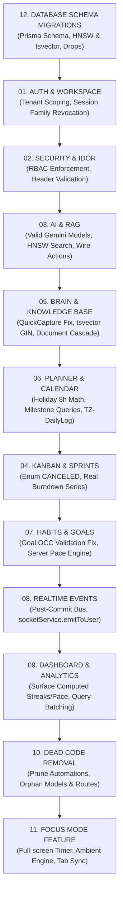

# KRAMA OS — Remediation Architecture Set

**Audience:** An autonomous coding agent (e.g. Gemini Pro 3.1 High) executing fixes directly against the live monorepo.  
**Stack:** `apps/web` (React 19, Tailwind v4, Vite 8) · `apps/server` (Express 5, Prisma 7, PostgreSQL 15 + pgvector, Redis, BullMQ 6) · `packages/validation` · `packages/types`.  
**Source of truth:** Two forensic audits of the live codebase + one Focus Mode design doc, all file paths/line numbers verified against running code as of 2026-09-19.

This is not advice. Every instruction below is written to be applied literally, in the order given, with no invented scope. If a step says "do not," it is a hard boundary, not a suggestion.

---

## 1. How to Use This Doc Set

Twelve files, each scoped to one subsystem. Each file is self-contained: scope, priority map, hard rules, numbered issues (symptom → root cause → exact file/line → exact fix → verification), a cleanup list, and a completion checklist. Execute one file at a time, top to bottom, run its checklist, then move to the next file in the **Global Execution Order** below. Do not jump ahead to a later file's issue because it looks related — cross-references are called out explicitly where they exist.

| # | File | Subsystem | Scope & Primary Objectives | Priority | Status |
|---|---|---|---|---|---|
| **12** | `12-DATABASE-SCHEMA-MIGRATIONS.md` | Database Schema Migrations | Consolidated Prisma migrations: add `TimeBlock.workspaceId`, link `Project`↔`Document`, drop legacy `Page`/`Decision`, add HNSW vector & `searchVector` tsvector indexes | **P0 Foundation** | **COMPLETED** |
| **01** | `01-AUTH-AND-WORKSPACE.md` | Multi-Tenancy & Auth | Multi-tenancy isolation, refresh token family revocation on reuse, workspace switching synchronization | **P0** | **COMPLETED** |
| **02** | `02-SECURITY-AND-IDOR.md` | Security & Access Control | Eliminate unvalidated `x-workspace-id` header trust, enforce RBAC on all mutation routes (POST/PATCH/DELETE), mitigate IDOR & DoS | **P1** | **COMPLETED** |
| **03** | `03-AI-AND-RAG.md` | AI Gateway & RAG Retrieval | Resolve live model outages (replace invalid model names with current Google GenAI models), route through `AiService` gateway with `AiRequest` logging, pgvector HNSW indexing, filter `deletedAt: null`, wire assistant UI actions | **P0 / P2** | **COMPLETED** |
| **05** | `05-BRAIN-KNOWLEDGE-BASE.md` | Brain & Knowledge Base | Prevent QuickCapture silent data loss, unified `Document` & `Space` architecture, PostgreSQL GIN full-text search trigger, soft-delete cascades | **P0 / P1** | Next Up |
| **06** | `06-PLANNER-AND-CALENDAR.md` | Planner & Calendar | Fix holiday capacity math (deduct 8h workday instead of 1h dummy block), fix Milestone unique query constraints, timezone-aligned daily log creation (P2002 avoidance) | **P0 / P2** | **COMPLETED** |
| **04** | `04-KANBAN-AND-SPRINTS.md` | Kanban & Sprint Execution | Align `CANCELED` status enum (eliminate `CANCELLED` silent failures), burndown chart time-series calculation, optimistic drag-and-drop state | **P1 / P2** | **COMPLETED** |
| **07** | `07-HABITS-AND-GOALS.md` | Habits & Strategic Goals | Fix goal `version` OCC Zod 400 outage, migrate OKR pace math server-side, timezone-aligned habit streak evaluation | **P0 / P2** | **COMPLETED** |
| **08** | `08-REALTIME-EVENTS.md` | Realtime Events & Bus | Dispatch domain events *post-transaction*, activate `socketService.emitToUser()` for notifications & cross-tab sync, remove hardcoded user fallbacks | **P1** | **COMPLETED** |
| **09** | `09-DASHBOARD-AND-ANALYTICS.md` | Dashboard & Analytics | Render computed `activeStreaks` and `okrPace` in UI, single-query dashboard metrics aggregation, distinguish unlogged vs zero-effort days | **P2** | **COMPLETED** |
| **10** | `10-DEAD-CODE-REMOVAL.md` | Dead Code Pruning | Safely prune uncalled Automations engine, drop orphaned models (`Certification`, `CareerMilestone`), remove dead route endpoints | **P3** | **COMPLETED** |
| **11** | `11-FOCUS-MODE-FEATURE.md` | Focus Mode Feature | Full-screen focus timer, ambient wallpaper & sound generator, cross-tab socket synchronization, automatic deep work timeblock attribution | **Feature (Additive)** | **COMPLETED** |

---

## 2. Global Execution Order

Fix order matters because later fixes assume earlier ones exist (e.g. the security layer in file 02 must land before Focus Mode's new endpoints in file 11, since those endpoints must be built with tenant-scoping already treated as the norm, not an afterthought).



1. **`12-DATABASE-SCHEMA-MIGRATIONS.md`** — run this first. It adds `TimeBlock.workspaceId`, fixes the `Project`↔`Document` relation, drops the obsolete `Page` and `Decision` models, creates the pgvector HNSW index, and sets up the `searchVector` trigger. Every other file assumes this migration has already run.
2. **`01-AUTH-AND-WORKSPACE.md`** — P0. Nothing else matters if users can't reliably stay in the right workspace and rotate refresh tokens securely.
3. **`02-SECURITY-AND-IDOR.md`** — P1. Close cross-tenant leaks and enforce RBAC across all verbs before adding or updating any surface area.
4. **`03-AI-AND-RAG.md`** — P0/P2. The AI outage (invalid model names) is a one-line-per-file fix with outsized production impact; do it early.
5. **`05-BRAIN-KNOWLEDGE-BASE.md`** — P0/P1. Silent data loss (QuickCapture) and hard-cascade deletion are active data-integrity risks.
6. **`06-PLANNER-AND-CALENDAR.md`** — P0/P2. Fix holiday capacity under-deduction and milestone unique constraint runtime failures.
7. **`04-KANBAN-AND-SPRINTS.md`** — P1/P2. Normalize `CANCELED` enums across the client and wire real burndown historical time series.
8. **`07-HABITS-AND-GOALS.md`** — P0/P2. Resolve goal progress update 400 validation outage and transition pace calculations server-side.
9. **`08-REALTIME-EVENTS.md`** — P1. Do this before Focus Mode (file 11), since Focus Mode's cross-tab sync depends on the same `socketService.emitToUser` pattern being proven to work.
10. **`09-DASHBOARD-AND-ANALYTICS.md`** — P2. Expose computed analytics (streaks, pace) and batch database overview queries.
11. **`10-DEAD-CODE-REMOVAL.md`** — do this after all functional fixes, never before (some "dead" code is dead only once its replacement lands).
12. **`11-FOCUS-MODE-FEATURE.md`** — new feature, additive, do last.

---

## 3. Global Hard Rules (apply to every file)

These override anything that looks locally convenient in any individual file.

1. **Never trust a client-supplied `workspaceId` without a membership check.** Every route that reads `x-workspace-id` from headers must verify `req.user.id` is a member of that workspace before using it in a query. This is the single most repeated defect across the codebase — treat it as a pattern to search for, not just a list of five call sites.
2. **Preserve the soft-delete contract.** This codebase uses `deletedAt: Date | null` as its recovery mechanism everywhere. Any fix that calls `.delete(...)` where the model has a `deletedAt` column is wrong unless the audit explicitly says "hard delete is intentional here." When in doubt, soft-delete.
3. **Scope every query by `workspaceId` and, where the data is personal, by `userId` too.** Multi-tenant leaks in this codebase come from omitting one of these two filters, not from a missing auth check.
4. **Do not introduce new dependencies to fix a bug that has a same-library fix available.** E.g. do not add a new Redis client, a new HTTP client, a new validation library — the existing `ioredis`, `fetchApi`, and `zod` usage already cover every fix in this set.
5. **Do not rewrite a whole file when a targeted patch fixes the issue.** Every fix below is scoped to specific lines. Minimal diffs only — this codebase is being stabilized, not rearchitected.
6. **Do not "helpfully" also fix an issue that isn't listed.** If you notice something else wrong while in a file, log it as a comment (`// TODO(audit): <description>`) and move on. Scope creep during a remediation pass is how regressions get introduced.
7. **Every fix that touches a controller or route must be verified against the exact reproduction steps given in that issue's "Verify" block before being considered done.** "It compiles" is not verification.
8. **Money-shaped and privacy-shaped fields never get logged.** None of these fixes require it, but if a fix path touches logging, do not add `console.log` of full request bodies, tokens, or user records.

---

## 4. Cross-Cutting Themes (read once, recognize everywhere)

- **The `x-workspace-id` header is trusted blindly in ~6 separate routes.** Files 01, 02, and 04 each fix one or more instances of this same defect. It is the same bug, six times.
- **`CANCELED` (one L) is the schema enum; `CANCELLED` (two Ls) appears in frontend string comparisons and silently fails.** Fixed once in file 04, but grep the whole `apps/web` tree for `'CANCELLED'` before declaring this done — the audits found it in two places (`TodayView.tsx`, `SprintView.tsx` logic) and it may exist elsewhere.
- **Prisma's `update`/`delete` `where` clause must reference a field that is actually unique** (`@id` or `@@unique`). The `Milestone` bug in file 06 is one instance of this; if you encounter Prisma runtime validation errors elsewhere during testing, this is the first thing to check.
- **`socketService.emitToUser()` exists and works — it is simply never called.** Files 08 and 11 both rely on this. Do not build a parallel notification mechanism; wire into this one.
- **Soft-deleted rows keep participating in unique constraints, RAG search, and joins because filters forget `deletedAt: null`.** This exact class of bug appears in file 05 (RAG retriever), file 06 (daily log P2002), and file 03 (RAG again). Treat "does this query filter deletedAt?" as a standing checklist item on every query you touch.

---

## 5. Features & Performance Optimization Architecture

The remediation set couples functional stability with architectural and computational optimization across the monorepo:

### 5.1 Architecture & Optimization Matrix

| Subsystem | Core Features | Performance & Optimization Vectors | Security & Tenancy Hardening | Data Integrity & Recovery Semantics |
|---|---|---|---|---|
| **01. Auth & Workspace** | JWT auth, Redis fast-path session validation, workspace switching | • Redis session cache (`session_revoked:${id}` 5m TTL)<br/>• Fast-path active workspace resolution in memory | • Revoke entire refresh token family on reuse attempt<br/>• Validate membership before issuing workspace scoped tokens | • Strict cascade invalidation on user/session deletion |
| **02. Security & IDOR** | RBAC role hierarchy (`OWNER` to `GUEST`), API gateway middleware | • Short-circuiting role hierarchy checks<br/>• Query-level workspace scoping | • Require `requireWorkspaceRole` across GET, POST, PATCH, and DELETE<br/>• Reject unauthorized `x-workspace-id` overrides | • Immutable tenant boundaries preventing cross-workspace writes |
| **03. AI & RAG** | Conversational assistant, document embeddings, vector similarity search | • PostgreSQL HNSW index on `KnowledgeChunk.embedding`<br/>• Shared chunking sizing `(800, 100)`<br/>• Single-pass structured output | • All prompts channeled via `AiService` gateway<br/>• Strict rate-limiting and quota tracking via `AiRequest` | • Explicit filter `deletedAt: null` on RAG corpus<br/>• Model provenance tracking on embedding vectors |
| **04. Kanban & Sprints** | Drag-and-drop boards, sprint planning, backlog triage | • Optimistic UI updates with rollbacks<br/>• Historical burndown aggregation via periodic snapshots | • Route-level `workspaceId` verification on task and column mutation | • Normalize status enum to `CANCELED` (single L)<br/>• Soft-delete preserving subtask relationships |
| **05. Brain Knowledge Base** | Tiptap rich-text editor, space hierarchy, full-text search | • PostgreSQL `tsvector` with `GIN` index (`searchVector`) for sub-millisecond search<br/>• Debounced auto-save | • Space and Document access scoped strictly to member workspaces | • Fix QuickCapture payload parser preventing note drops<br/>• Soft-delete tree cascade for document hierarchies |
| **06. Planner & Calendar** | Weekly capacity planner, daily logs, holiday integration | • Memoized holiday dates<br/>• Cached holiday provider responses | • Strict user and workspace scoping on personal planner entries | • Full workday deduction (8h) for holidays instead of 1h dummy block<br/>• Query by `@id` on Milestone models |
| **07. Habits & Goals** | 30-day habit heatmap, OKR goal tracking, streak auditing | • Server-side pace computation eliminating client snapshot transfers<br/>• Nightly BullMQ streak audit worker | • Restrict goal progress updates to active workspace members | • Reconcile `UpdateGoalSchema` Zod validation with frontend mutation<br/>• Timezone-aware streak boundary calculation |
| **08. Realtime Events** | Socket.io event emitter, notification delivery, live sync | • Event emission moved outside `runInTransaction` (post-commit)<br/>• Targeted `emitToUser` socket rooms | • Authenticated socket handshake with token verification<br/>• Room isolation per workspace | • Eliminates phantom event emissions on transaction rollbacks |
| **09. Dashboard & Analytics** | Executive overview, velocity charts, deep work analytics | • Consolidated multi-metric aggregation query (single DB roundtrip)<br/>• Nightly background pre-aggregation | • Read-only `VIEWER` role required for dashboard metrics | • Distinct representation for unlogged vs zero-effort days<br/>• Expose computed `activeStreaks` and `okrPace` in UI |
| **10. Dead Code Removal** | Clean operational surface, lean bundle | • Decreased JS bundle size in `apps/web`<br/>• Reduced Prisma Client memory footprint | • Shrinks attack surface by deleting unmaintained route handlers | • Safe dropped tables (`Page`, `Decision`, `Certification`, `CareerMilestone`) verified L0 |
| **11. Focus Mode Feature** | Full-screen timer, ambient audio engine, wallpaper presets | • Lightweight CSS animations<br/>• Audio synthesized/streamed efficiently<br/>• Realtime cross-tab sync | • Session logging attributed to verified user & workspace | • Seamless attribution to `FocusSession` and `TimeBlock` records |
| **12. DB Schema Migrations** | PostgreSQL schema definitions, indexing, foreign keys | • HNSW index for cosine distance vector search<br/>• GIN index on tsvector for text search | • `workspaceId` added to `TimeBlock` to guarantee relational isolation | • Proper foreign key constraints on `Project` ↔ `Document` |

---

## 6. Monorepo Architecture & Flow

```
                      ┌────────────────────────────────────────────────┐
                      │              WebApp Client                     │
                      │     (React 19 / Vite 8 / Tailwind v4)          │
                      └─────────────┬────────────────────┬─────────────┘
                                    │ HTTP / REST        │ WebSockets (Socket.io)
                                    ▼                    ▼
                      ┌────────────────────────────────────────────────┐
                      │             Express 5 Gateway                  │
                      │   [requireAuth] -> [requireWorkspaceRole]      │
                      └───────┬──────────────┬───────────────┬─────────┘
                              │              │               │
                              ▼              ▼               ▼
                      ┌──────────────┐┌──────────────┐┌────────────────┐
                      │ Business Svc ││  AI Gateway  ││ Socket Service │
                      │  (Tasks,     ││ (Gemini Svc, ││ (emitToUser,   │
                      │   Brain,     ││  RAG vector  ││  workspace     │
                      │   Planner)   ││  retriever)  ││  rooms)        │
                      └───────┬──────┘└──────┬───────┘└────────────────┘
                              │              │
                              ▼              ▼
                      ┌──────────────────────────────┐   BullMQ Jobs   ┌─────────────────┐
                      │     Prisma 7 Client ORM      │ ──────────────> │ BullMQ Workers  │
                      └──────────────┬───────────────┘                 │ (Embeddings,    │
                                     │                                 │  Analytics,     │
                                     ▼                                 │  Streak Audits) │
                      ┌──────────────────────────────┐                 └────────┬────────┘
                      │   PostgreSQL 15 + pgvector   │ <────────────────────────┘
                      │ (HNSW index, tsvector GIN,   │
                      │  foreign-keyed Bridge Layer) │
                      └──────────────────────────────┘
```

---

## 7. Definition of Done (for the whole remediation pass)

- Every issue in files 01–09 has its "Verify" step passing.
- Every item in `10-DEAD-CODE-REMOVAL.md` is either deleted or explicitly deferred with a written reason.
- `11-FOCUS-MODE-FEATURE.md` is implemented and its own verification plan (TypeScript build, Playwright spec, manual browser checklist) passes.
- `npx tsc -b` passes with zero errors across `apps/web` and `apps/server`.
- No file was rewritten wholesale where a patch would do (Global Hard Rule 5).
- No new "orphaned" endpoint was created — every new backend route has at least one real frontend caller by the time this pass is complete (this was the root failure mode behind the AI subsystem's dead endpoints; do not repeat it).
